# Photo Frame Manager

Unity editor tool to manage photos and picture frames, and bake to optimized textures that use less memory, require fewer materials, and are sorted for mipmap streaming. Comes with photo cropping, scaling, and resizing builtin with a live preview in the 3d scene and inspector.

This works for VRChat or any other unity projects. Note that this is an editor utility that makes and sets up assets for you before you build.

---

## Install

**Window** > **Package Manager**

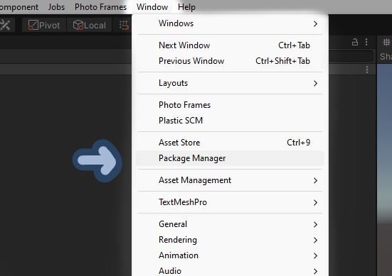

Plus button (**+**) > **Add package from git URL...**

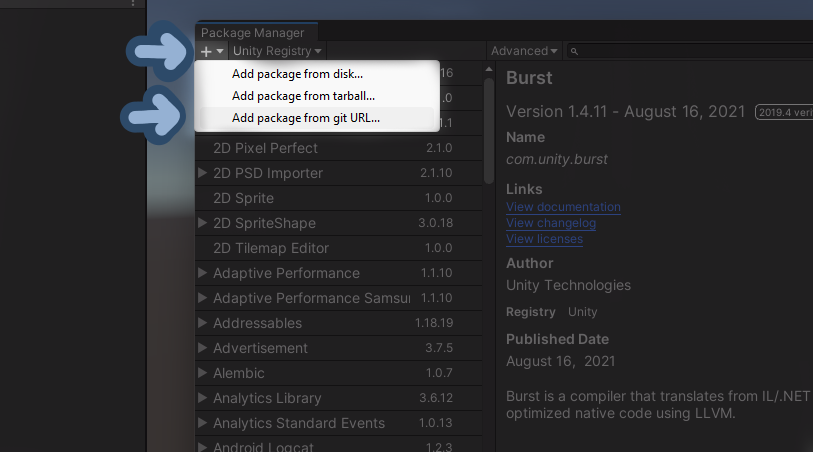

Paste the url https://github.com/codec-xyz/photo_frame_manager.git and click add

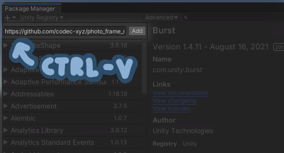

> Free to use picture frames fully set for this package can be downloaded here https://github.com/codec-xyz/photo_frame_manager/releases/tag/v1.0.0
>
> These picture frames are CC0 (Public Domain)

## Setup Photo Frames

**Right click in the Hierachy** or click the **GameObject** menu at the top to open the game object context menu and click **Photo Frame** to add an empty photo frame to the scene.

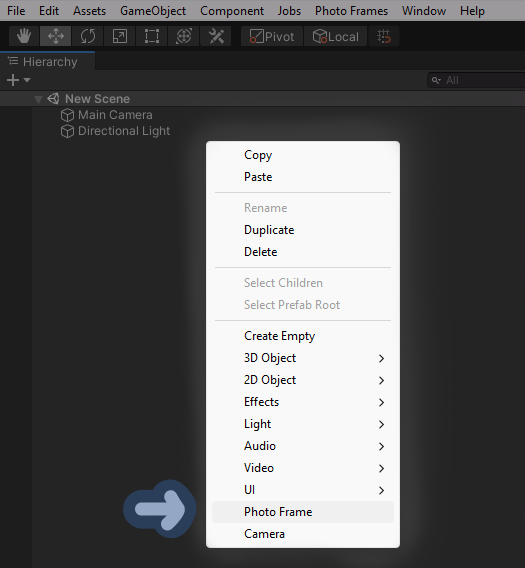

**Or** you can right click on some image files in the project file view and select **Add Images as Photo Frames** to add photo frames with the selected images set. You can add many images at once this way.

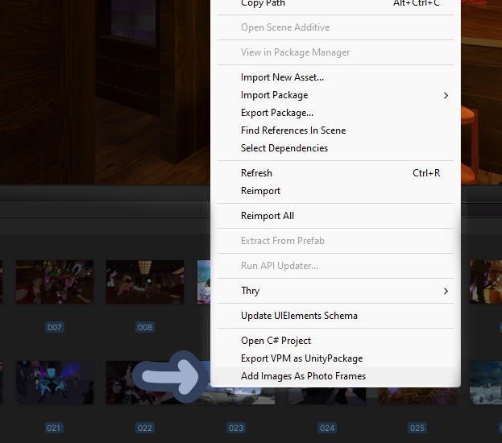

## Photo Frame Settings

Select the photo frame and look in the **Inspector** to see the settings.

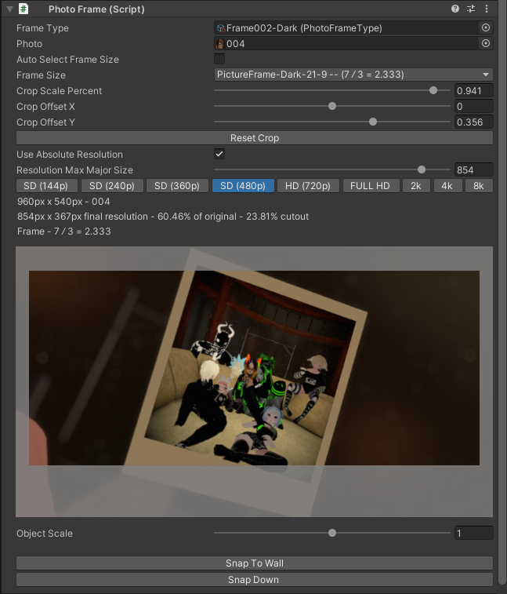

**Frame Type** - the picture frame set that you want to use (this is a file type this package adds). A picture frame set has multiple of the same looking picture frames but with different aspect ratios. It also sets the material of the photo. Setting this to none will result in just the photo with the default unlit material. More detail on the Photo Frame Type file further down

**Photo** - the photo you want to use

**Auto Select Frame Size** - when checked will auto select the best matching frame size. If the frame type is set to none or the frame type file has no picture frames added will use the original photo aspect ratio. When uncheck lets you manually pick the picture frame. If the frame type is set to none or the frame type file has no picture frames added lets you select a custom aspect ratio

**Crop Scale Percent** - zooms the crop in

**Crop Offset X** - move the crop left or right. Note that this will do nothing if the crop is already at that edge

**Crop Offset Y** - move the crop up or down. Note that this will do nothing if the crop is already at that edge

**Use Absolute Resolution** - when checked the option below lets you set the photo resolution in pixel units. When unchecked the option below lets you set the resolution as a multiple of the original

**Resolution Max Major Size** - the size in pixels you want for the photo's larger side to be. Acts as an upper limit so if the size is larger than the photo's actual size its resolution stays unchanged. The buttons below are some presets for this value. This option is only visible when Use Absolute Resolution is checked

The selected photo is displayed with a grey overlay to show the area being cropped out.

**Object Scale** - a slider to more easily change the object's scale. The slider is non linear and the max value changes based on the current scale

**Snap To Wall** - moves the photo frame to the nearest collider behind it

**Snap Down** - moves the photo frame to the nearest collider below it

All of these settings including the resolution update the photo frame preview in the 3d scene live.

## Photo Frame Type Files

These files define picture frames. They are a set of picture frames that should look the same but have different aspect ratios. They also hold a material that gets copied and used for the photo.

> Free to use picture frames fully set for this package can be downloaded here https://github.com/codec-xyz/photo_frame_manager/releases/tag/v1.0.0
>
> These picture frames are CC0 (Public Domain)

If you want to setup your own first find or make some picture frame meshes. They need the space for the photo to be centered at (0, 0, 0) with it pointing in the positive direction on the z-axis in unity's coordinates; and the space for the photo needs to have one side of length one (either the smaller or larger side, just keep it consistent). Then bring them into unity in any format that can be drop directly into a scene for example: fbx, prefabs, etc.

Then right click in the project file view > **Create** > **Photo Frame Type**

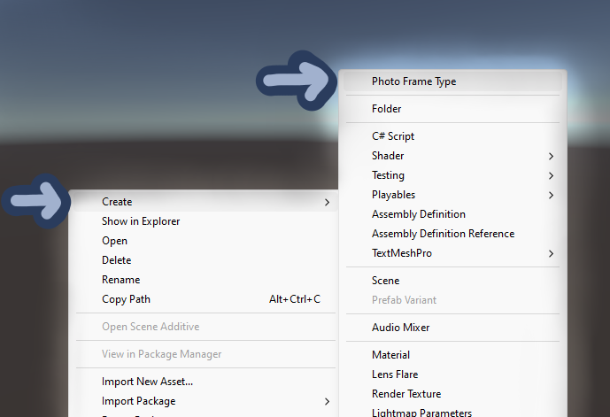

Select the file and look in the **Inspector** to see the settings.

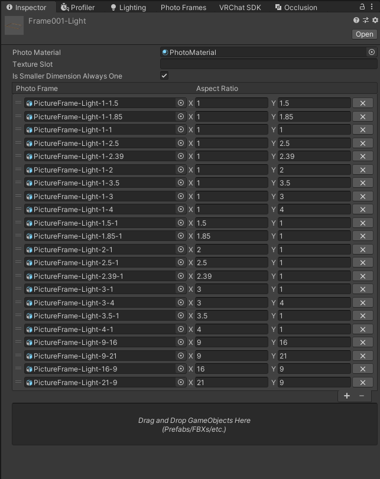

**Photo Material** - the material that gets copied and used for the photo. All values in the material are kept. Leaving this blank will result in the photo using the default unlit material

**Texture Slot** - a string of the texture slot to use on the material for the photo. If left blank the mainTexture slot is used

**Is Smaller Dimension Always One** - whether the picture frames are setup with the smaller side of space for the photo being length one

The rest is a list of the picture frame file and its aspect ratio. The order does not matter except that the first object in the list used the preview. Leaving the list blank is okay and will result in no picture frames. This can be used to just set the material of a photo.

The box at the bottom can be used to drag and drop one or more GameObject files into the list. This will also try to get the aspect ratios from the file names.

## Baking Photo Frames

In order to export your project the photo frames must be baked first. This will sort, pack, and merge the photos into a set of textures and picture frames and photo meshes will be set up.

As a note, for best preformance when baking make sure **Jobs** > **Burst** > **Enable Compilation** is checked. However the largest bottleneck of the baking proccess is unity importing all the created objects.

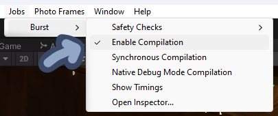

In the **Photo Frames** menu you can directly **Bake Photo Frames** and also delete the baked data.

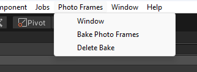

If you click the **Photo Frames** > **Window** that will bring up a window with bake settings, a list of photos in the scene to find specific photos easily, and a list of baked textures with info about each.

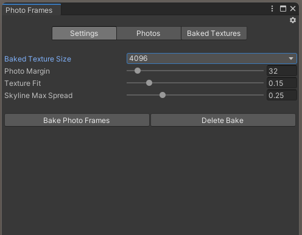

These settings are saved directly into the scene file, and all generated assets (materials, meshes, textures) are saved into the "Assets/PhotoFramesAutoGenerated" folder.

**Bake Texture Size** - the target size of the baked textures. Some texture might be smaller to reduce size

**Photo Margin** - extra colored area around photos to prevent texture bleeding; measured in pixels

**Texture Fit** - sorting prioritization (spacial sorting for better mipmap streaming vs fewer textures)
- 0 - sorted for better mipmap streaming
- 1 - sorted for fewer textures

**Skyline Max Spread** - a parameter to the pack algorithm. Its functionality is hard to explain without an explanation of the pack algorithm. A link to the paper about the packing algorithm used is linked below.

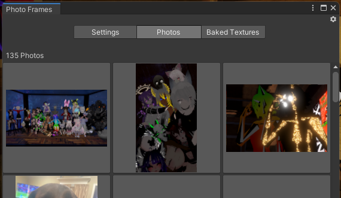

These are all the photos present in the scene. Clicking a photo will select and highlight that photo frame in the scene.

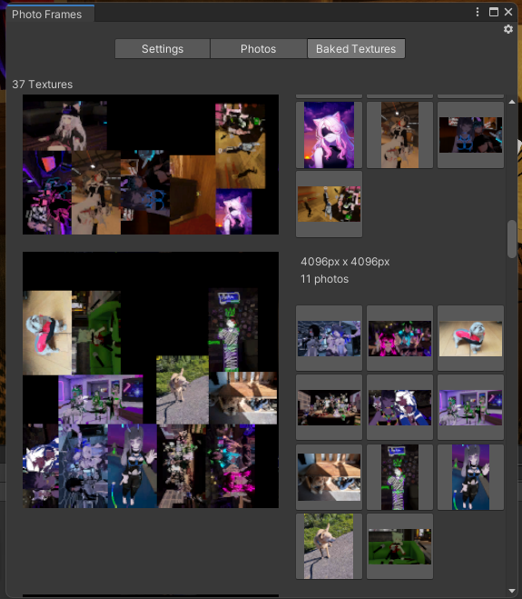

These are all the baked textures currently saved and some information about each. Clicking a photo will select and highlight that photo frame in the scene.

## Untracked Assets

When running **Delete Bake** only known and tracked assets are deleted. If for what ever reason assets are created but lost track of, like in the case of a crash during a bake or bug in the code, then they will not be deleted. All created assets are placed in "**Assets/PhotoFramesAutoGenerated**" and all files in that folder **are safe to delete** and can be completely regenerated.

## Performance And Memory Improvements

This unity package improves the performance and memory usage compared to having seperate textures and materials per photo and does all this with a single click. Simplicity and ease of use is very important.

The baking process has a purpose built sorting step that places physicaly close photos in the same textures. This aides the mipmap streaming process since far away photos are grouped into their own textures and the full resolution texture does not need to be kept in vram thus reducing vram usage. Mipmap streaming is a process handled by unity and the baked textures are set up for mipmap stream automatically when you bake photo frames.

As a note moving around the photo frames a lot during runtime could make the mipmap streaming less effective. In such a case the Texture Fit bake setting can be set to 1 to prioritize fewer textures over mipmap streaming optimization.

The photos are also packed and merged. GPUs generally require square and power of 2 (...1024, 2048, 4096...) textures and textures that do not match are wastefully made to fit. Photos are often not power of 2 and not square, so packing many photos in square power of 2 texture helps to reduce vram usage. Multiple photos sharing a single texture also means fewer materials are required thus reducing draw calls and improving performance.

## Attributions

Ambient CG - https://ambientcg.com/

Packing algorithm in this package is based on... - https://www.researchgate.net/publication/221049934