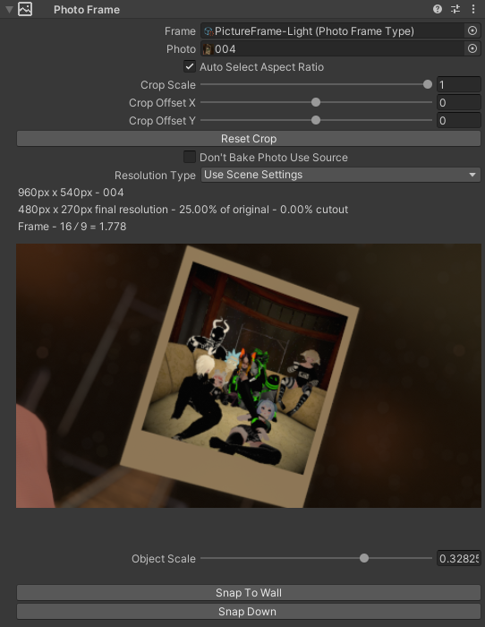

# Photo Frame Manager

Photo frame manager and optimizer package for Unity. Has photo cropping, scaling, and resizing with live previews in the 3d scene and inspector. Bakes photos to optimized textures which reduce gpu memory usage, lower the material count, and are optimized for mipmap streaming.

Tested for Unity2019, Unity2021, Unity2022, and VRChat. Note that this is an editor only utility that makes and sets up assets for you before you build.

## Installing (VRChat Creator Companion)

Have VCC installed first https://vcc.docs.vrchat.com/

Click this [Add Photo Frames Manager To VCC](https://codec-xyz.github.io/photo_frame_manager/vccAdd.html)

Now in VCC when managing a project, the Photo Frame Manager package will appear in the list of available packages.

## Installing (Unity Only)

**Window** > **Package Manager**

Plus button (**+**) > **Add package from git URL...**

Paste the URL https://github.com/codec-xyz/photo_frame_manager.git?path=/src and click add.

## Adding Photo Frames

**Right click in the Hierarchy** or click the **GameObject** menu at the top to open the game object context menu and click **Photo Frame** to add an empty photo frame to the scene.

### Or

You can right click on some image files in the project file view and select **Add Images as Photo Frames** to add photo frames with the selected images set. You can add many images at once this way.

## Photo Frame Settings

Select the photo frame and look in the **Inspector** to see the settings.

**Frame Type** - the frame set that you want to use (this is a file type this package adds). A frame set has multiple of the same looking frames but with different aspect ratios. It also sets the material of the photo. Setting this to none will result in just the photo with the default unlit material. More detail on the Photo Frame Type file further down

**Photo** - the photo you want to use

**Auto Select Aspect Ratio** - when checked will auto select the best matching aspect ratio based on the frame and photo's aspect ratio

**Crop Scale** - zooms the crop in

**Crop Offset X** - move the crop left or right

**Crop Offset Y** - move the crop up or down

**Don't Bake Photo Use Source** - does not bake photo. Uses the specified photo as the material texture

**Resolution Type** - the way the resolution is controlled
- **Use Scene Settings**
- **Resolution Max Major Size** - the size in pixels you want for the photo's larger side to be. Acts as an upper limit so if the size is larger than the photo's actual size its resolution stays unchanged. The buttons below are some presets for this value
- **Relative** - value 0 - 1 that scales the photos full resolution
- **Full** - resolution stays unchanged. Note if the baked texture size is smaller than the resolution will be lowered to fit

The selected photo is displayed with a grey overlay to show the area being cropped out.

**Object Scale** - a slider to more easily change the object's scale. The slider is nonlinear and the max value changes based on the current scale

**Snap To Wall** - moves the photo frame to the nearest collider behind it

**Snap Down** - moves the photo frame to the nearest collider below it

All of these settings, including the resolution, update the photo frame preview in the 3d scene live.

## Baking Photo Frames

To export your project, the photo frames must be baked first. This will sort, pack, and merge the photos into a set of textures; and frame and photo meshes will be set up.

As a note, for best performance when baking, make sure **Jobs** > **Burst** > **Enable Compilation** is checked. However, the largest bottleneck of the baking process is unity importing all the created objects.

In the **Photo Frames** menu you can directly **Bake Photo Frames** and delete the baked data.

If you click the **Photo Frames** > **Window** that will bring up a window with bake settings, a list of photos in the scene to find specific photos easily, and a list of baked textures with info about each.

These settings are saved directly into the scene file, and all generated assets (materials, meshes, textures) are saved into the "Assets/PhotoFramesAutoGenerated" folder.

### Bake Settings

**Bake Texture Size** - the target size of the baked textures. Some texture might be smaller to reduce size

**Photo Margin** - extra colored area around photos to prevent texture bleeding; measured in pixels

**Scale Photo Margin** - scales the photo margin down when baked textures are below the specified baked texture size

**Join Duplicate Photos** - joins duplicate photos in baked texture

**Scale Resolution By Size** - scales the resolution of photos based on their scale. Resolution starts being lowered at the maximum value and stops at the minimum value. Photos with resolution full are skipped

**Resolution Max Major Size** - photo frames set to \"Use Scene Settings\" will use this resolution value

### Advanced Settings

**Texture Fit** - sorting prioritization (special sorting for better mipmap streaming vs fewer textures)
- 0 - sorted for better mipmap streaming
- 1 - sorted for fewer textures

**Estimated Pack Efficiency** - expected packing efficiency used when sorting

A link to the paper about the packing algorithm used is linked below.

**Skyline Max Spread** - a parameter to the pack algorithm

**Overhang Weight** - a parameter to the pack algorithm

**Neighborhood Waste Weight** - a parameter to the pack algorithm

**Top Waste Weight** - a parameter to the pack algorithm

### Texture Settings

These are named the same as Unity's texture import settings. The docs are found here https://docs.unity3d.com/Manual/class-TextureImporter.html

These are all the photos present in the scene. Clicking a photo will select and highlight that photo frame in the scene.

These are all the baked textures currently saved and some information about each. Clicking a photo will select and highlight that photo frame in the scene.

## Photo Frame Type Files

Some fully setup frames are included with this package.

These files define frames. They are a set of frames that should look the same but have different aspect ratios. They also hold a material that gets copied and used for the photo and other settings.

**If you want to setup your own** bring the model(s) into unity in any format that can be dropped directly into a scene for example: .fbx, .obj, .blend, .prefabs, etc. Then right click in the project file view > **Create** > **Photo Frame Type**

Select the file and look in the **Inspector** to see the settings.

**Photo Material** - the material that gets copied and used for the photo. All values in the material are kept. Leaving this blank will result in the photo using the default unlit material

**Texture Slot** - list of slots to use on the photo's material (In preview mode some textures like normal textures do not get enabled by Unity unless that texture is set in the source material. This does not effect baked photos)

It is important to define the position, rotation, and size of the photo to match the frame model. **Photo Offset** and **Photo Rotation** define the position and rotation of the photo relative to the model. **Photo Dimensions** defines how to size the photo.

**Photo Offset** - photo offset to match the frame

**Photo Rotation** - photo rotation to match the frame

**Photo Dimensions** - setting for sizing the photo to match the frame (the photo's dimension setting is a drop down of functions and not a single value because the size depends on the photo's aspect ratio)
- **Larger Side Is One**
- **Smaller Side Is One**
- **Use Aspect Ratio** - uses the **Aspect Ratio** value in the frame model list as the size. For example, if your frame is sized for a photo 0.4 x 0.4 units, change the aspect ratio from 1 x 1 to 0.4 x 0.4

Next you can pick if you want the photo frame manager to match the frames to your photo's aspect ratio. If your photo's aspect ratio is not one in the list the photo can either be cropped to the closest aspect ratio or the closest aspect ratio frame can be modified to be the exact aspect ratio needed. The recurring **Limit Aspect Ratios To List** lets you define a list of aspect ratio by adding other entries to the frame model list with no model set. The frame matching functionally only uses the closest aspect ratio frame model list entry with a model set.

**Frame Matching** - settings for how the frame is resized to match the photo (The closest aspect ratio frame model is picked and modified)
- **None** - the frame is not resized. The photo will be cropped to the frame's aspect ration
- **Scale To Photo** - the frame is scaled to the photo's aspect ration (The 3 dimensions are scaled unequally causing frame borders and textures to also stretch unequal)
  - **Limit Aspect Ratios To List** - limit available aspect ratios to the frame model list
- **Generate Frame** - algorithm to resize frame meshes to different aspect ratios. Preserves frame border sizes and offsets texture UVs to avoid texture stretching
  - **Offset Frame UVs** - if UVs should offset to avoid texture stretching
  - **UV Orientation Threshold** - threshold used to filter aligned edges to determine UV island orientation
  - **Limit Aspect Ratios To List** - limit available aspect ratios to the frame model list
  - **Gear Icon > Generate And Save Missing Frames** - action to generate, save, and set all frame model list entries without a model set, using this algorithm

**Frame Model List** - a list of the frame files and their aspect ratio. The order does not matter except that the first model in the list is used as the preview. Leaving the list blank is okay and will result in no frame; useful for setting just the material of a photo.

The box at the bottom can be used to drag and drop one or more GameObject files into the list. This will also try to get the aspect ratios from the file names.

## UI Alignment

If you don't like the right aligned fields you can turn them off in **Window Manger** > **Gear icon** in the top right > **Right Aligned Fields**

## VRChat Integration

When building a VRChat world and the photo frames are not fully baked this dialogue shows...

## Untracked Assets

When running **Delete Bake** only known and tracked assets are deleted. If for whatever reason assets are created but lost track of, like in the case of a crash during a bake or bug in the code, then they will not be deleted. All created assets are placed in "**Assets/PhotoFramesAutoGenerated**" and all files in that folder **are safe to delete** and can be completely regenerated.

## Performance And Memory Improvements

This unity package improves performance and memory usage compared to having separate textures and materials per photo and does all this with a single click. Simplicity and ease of use are very important.

The baking process has a purpose-built sorting step that places physically close photos in the same textures. This aides the mipmap streaming process since far away photos are grouped into their own textures and the full resolution texture does not need to be kept in vram thus reducing vram usage. Mipmap streaming is a process handled by unity and the baked textures are set up for mipmap streaming automatically when you bake photo frames.

As a note moving around the photo frames a lot during runtime could make the mipmap streaming less effective. In such a case the Texture Fit bake setting can be set to 1 to prioritize fewer textures over mipmap streaming optimization.

The photos are also packed and merged. GPUs generally require square and power of 2 (...1024, 2048, 4096...) textures and textures that do not match are wastefully made to fit. Photos are often not power of 2 and not square, so packing many photos in square power of 2 texture helps to reduce vram usage. Multiple photos sharing a single texture also means fewer materials are required thus reducing draw calls and improving performance.

## Attributions

Ambient CG - https://ambientcg.com/

Packing algorithm in this package is based on... - https://www.researchgate.net/publication/221049934